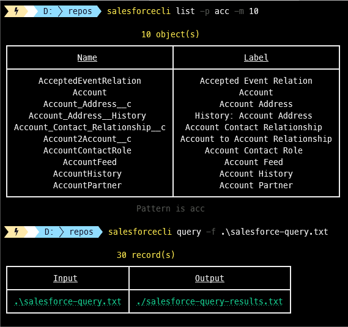

[](https://github.com/aimenux/SalesForceCli/actions/workflows/ci.yml)

# SalesForceCli
```
Providing net global tool in order to query salesforce
```

> In this repo, i m building a global tool that allows to query [salesforce](https://www.salesforce.com/).
>
> The tool is based on multiple sub commmands :
> - Use sub command `List` to list salesforce objects/fields
> - Use sub command `Query` to run salesforce queries
> - Use sub command `Generate` to generate salesforce queries
>
>
> To run code in debug or release mode, type the following commands in your favorite terminal : 
> - `.\App.exe List`
> - `.\App.exe List -m 100`
> - `.\App.exe List -p [pattern]`
> - `.\App.exe List -n [ObjectName]`
> - `.\App.exe Query -f [FileName]`
> - `.\App.exe Generate -n [ObjectName]`
>
>
> To install, run, update, uninstall global tool from a local source path, type commands :
> - `dotnet tool install -g --configfile .\Nugets\local.config SalesForceCli`
> - `SalesForceCli -h`
> - `SalesForceCli -s`
> - `SalesForceCli List`
> - `SalesForceCli List -m 100`
> - `SalesForceCli List -p [pattern]`
> - `SalesForceCli List -n [ObjectName]`
> - `SalesForceCli Query -f [FileName]`
> - `SalesForceCli Generate -n [ObjectName]`
> - `dotnet tool update -g SalesForceCli --ignore-failed-sources`
> - `dotnet tool uninstall -g SalesForceCli`
>
> To install global tool from [nuget source](https://www.nuget.org/packages/SalesForceCli), type these command :
> - For stable version : `dotnet tool install -g SalesForceCli --ignore-failed-sources`
> - For prerelease version : `dotnet tool install -g SalesForceCli --version "*-*" --ignore-failed-sources`
>
>
> 
>

**`Tools`** : vs22, net 6.0, salesforce-sdk, command-line, spectre-console
